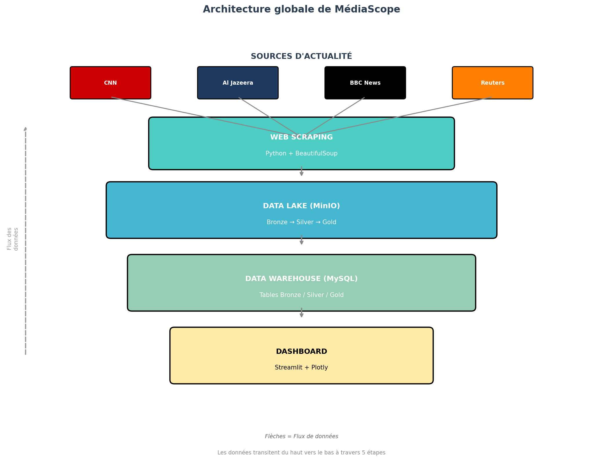
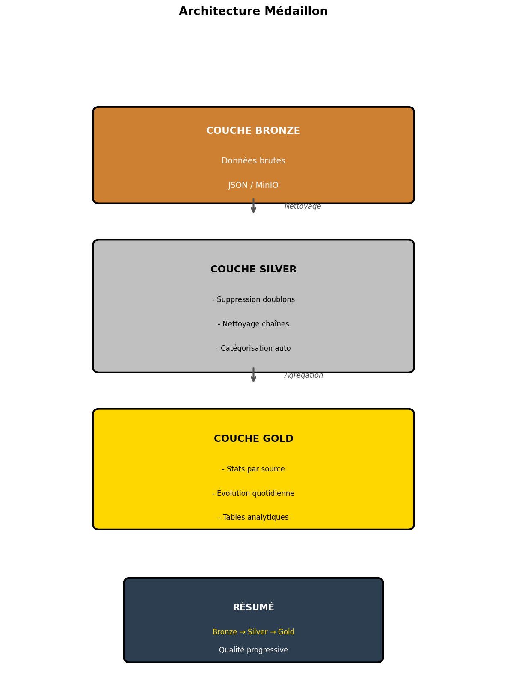
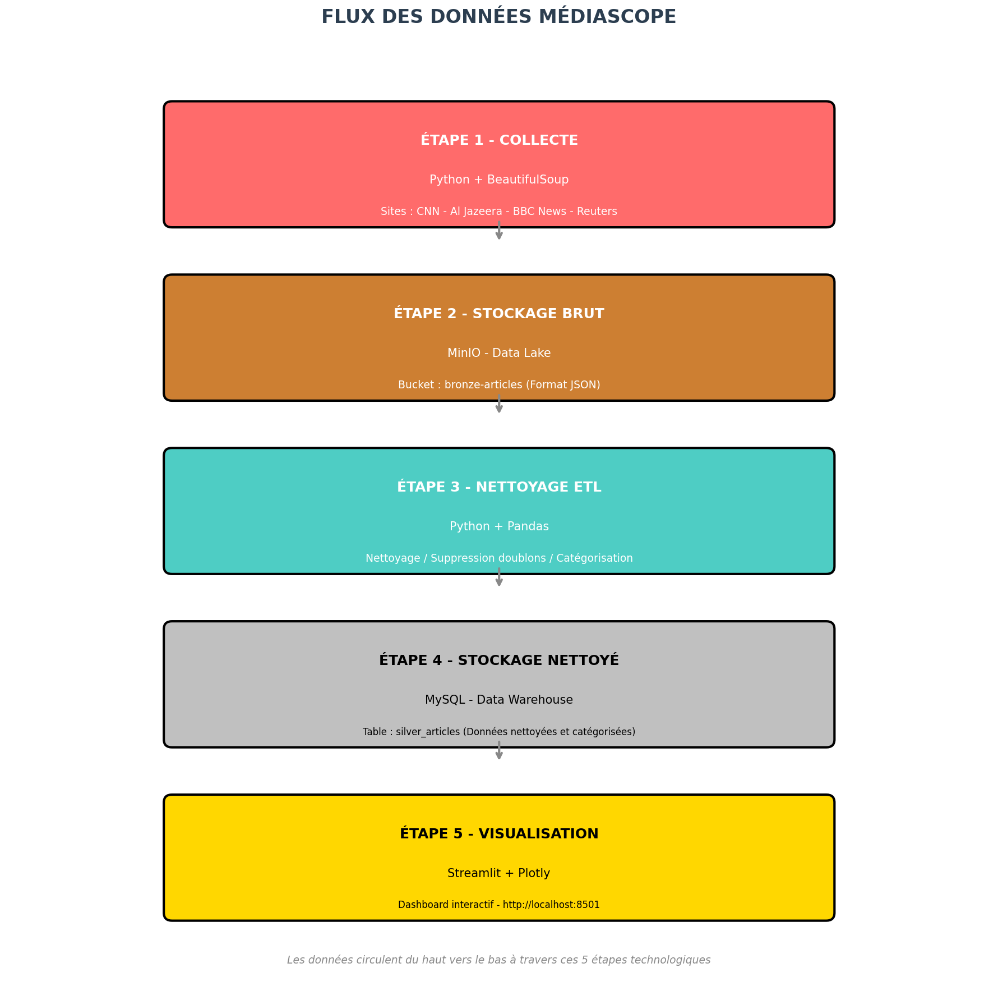
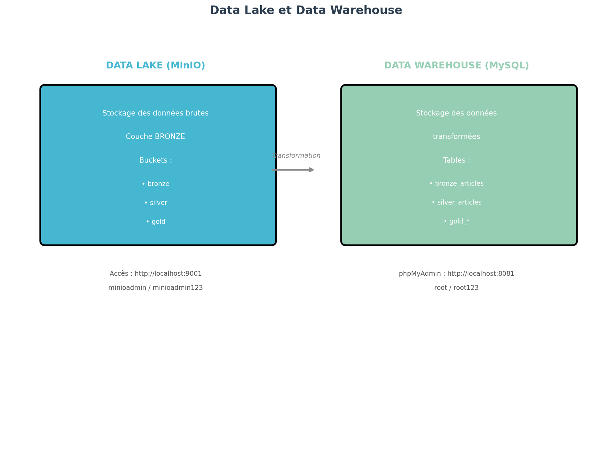
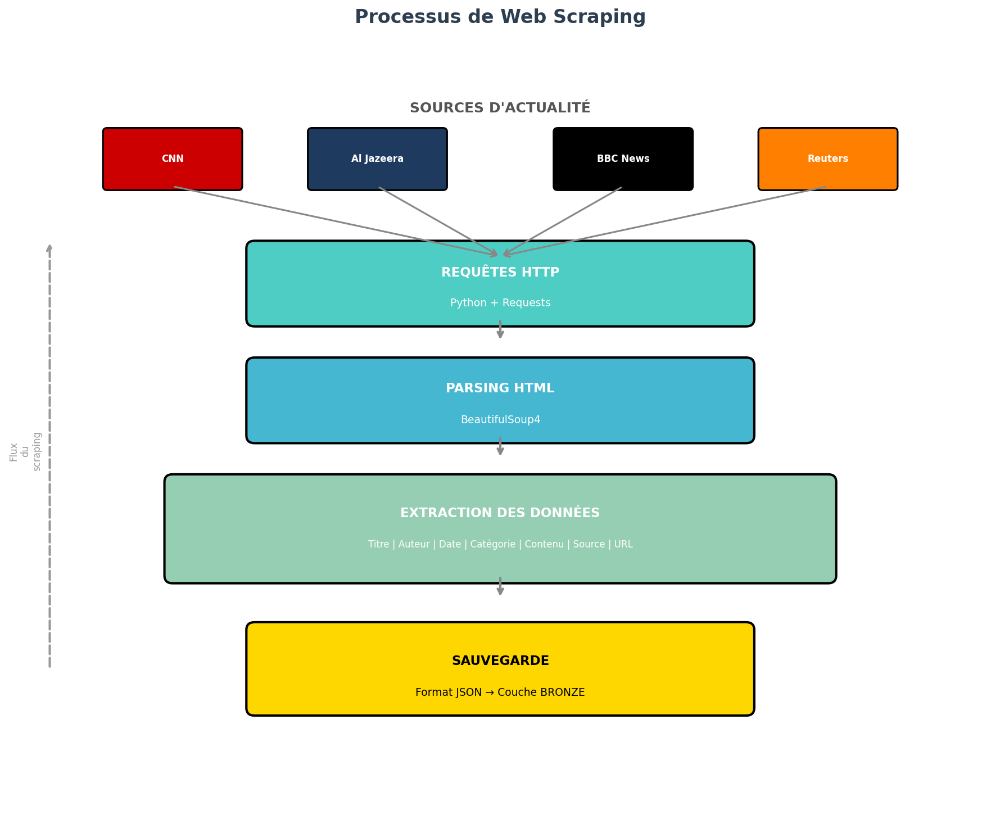

# MediaScope

## End-to-End Data Engineering Platform for News Analytics

MediaScope is a Data Engineering and Big Data project designed to collect, process, store, and analyze news articles from multiple international sources.

The platform implements an end-to-end data pipeline combining web scraping, a Data Lake, Medallion Architecture, ETL processing, workflow orchestration, containerized infrastructure, and interactive data visualization.

The project demonstrates how raw data collected from heterogeneous sources can be transformed into structured and exploitable information for analytical purposes.

---

## Overview

Every day, news platforms generate a large volume of articles covering a wide range of topics.

MediaScope addresses the challenge of transforming this continuous flow of information into structured data that can be explored and analyzed.

The platform follows a complete data pipeline:

    News Sources
          |
          v
    Web Scraping
          |
          v
    Bronze Layer
    Raw Data / Data Lake
          |
          v
    Data Cleaning & Transformation
          |
          v
    Silver Layer
    Cleaned & Structured Data
          |
          v
    Gold Layer
    Analytical Data
          |
          v
    Dashboard & Analytics

Apache Airflow is used to orchestrate the data processing workflow, while Docker provides a reproducible infrastructure environment.

---

## Key Features

- Automated collection of news articles from multiple sources
- Web scraping and data ingestion
- Data Lake storage using MinIO
- Three-layer Medallion Architecture
- Bronze, Silver, and Gold data layers
- Data cleaning and transformation
- ETL pipeline implementation
- Apache Airflow workflow orchestration
- MySQL-based structured data storage
- Interactive data visualization dashboard
- Docker-based infrastructure
- Data quality and transformation management
- Modular architecture for adding new data sources
- Architecture and data-flow documentation

---

## Data Sources

The project was designed to collect articles from several international news sources, including:

- CNN
- BBC News
- Al Jazeera
- Reuters

The ingestion layer can be extended to support additional sources.

---

## Data Architecture

MediaScope follows a Medallion Architecture that separates data processing into three progressive layers.

### Bronze Layer

The Bronze layer stores the raw data collected from the different news sources.

Characteristics:

- Raw scraped articles
- Original source information
- Historical data preservation
- Minimal transformation

This layer acts as the landing zone for incoming data.

### Silver Layer

The Silver layer contains cleaned and structured data.

Processing includes:

- Data cleaning
- Normalization
- Duplicate handling
- Format standardization
- Data transformation
- Data enrichment

The goal is to produce reliable and consistent data for downstream analysis.

### Gold Layer

The Gold layer is designed for analytical use.

It provides processed information suitable for:

- Trend analysis
- Source comparison
- Topic analysis
- Dashboard visualization
- Historical analysis

---

## Architecture

The overall architecture combines several components:

- Web scraping for data ingestion
- MinIO for Data Lake storage
- Python-based transformation scripts
- MySQL for structured data storage
- Apache Airflow for workflow orchestration
- Docker for infrastructure and reproducibility
- Dashboard for visualization and analysis

### Global Architecture

### Medallion Architecture

### Data Flow

### Data Lake and Data Warehouse

### Web Scraping Architecture

---

## ETL Pipeline

The MediaScope pipeline follows an Extract, Transform, Load approach.

### 1. Extract

News articles are collected from multiple web sources using Python-based web scraping.

The extraction stage captures relevant article information and prepares it for storage.

### 2. Transform

The collected data is cleaned and transformed before being used for analysis.

Typical operations include:

- Cleaning raw fields
- Standardizing formats
- Removing duplicates
- Structuring article information
- Preparing analytical attributes

### 3. Load

Processed information is stored in the appropriate data layer and made available for analytical use.

---

## Workflow Orchestration

Apache Airflow is used to orchestrate the MediaScope pipeline.

The main workflow follows:

    Start
      |
      v
    Scrape Articles
      |
      v
    Clean Articles
      |
      v
    End

The pipeline is scheduled periodically and includes retry mechanisms to improve workflow reliability.

The DAG is available in:

    dags/mediascope_dag.py

---

## Data Lake

MinIO is used as object storage for the Data Lake component.

The Data Lake provides a centralized location for storing raw and processed data while maintaining the different stages of the Medallion Architecture.

This approach makes it possible to preserve historical information and support future reprocessing and analysis.

---

## Data Warehouse

MySQL is used as the structured database component of the platform.

It provides a relational environment for storing structured information and supporting analytical workloads.

phpMyAdmin is included in the Docker environment to facilitate database administration and inspection during development.

---

## Dashboard

MediaScope includes a dashboard for exploring the processed news data.

The dashboard provides a visual interface for analyzing aspects such as:

- News distribution
- Sources
- Topics
- Trends
- Frequently occurring keywords
- Historical information

The dashboard is implemented in:

    dashboard_mediascope_v3.py

---

## Docker Infrastructure

The project uses Docker Compose to provide a reproducible development environment.

The infrastructure includes:

- MySQL
- MinIO
- phpMyAdmin
- Apache Airflow

This allows the different services required by the platform to be started and managed consistently.

---

## Project Structure

    MediaScope/
    │
    ├── dags/
    │   └── mediascope_dag.py
    │
    ├── src/
    │   ├── scraper.py
    │   └── cleaner.py
    │
    ├── data/
    │   ├── bronze/
    │   ├── silver/
    │   └── gold/
    │
    ├── docs/
    │   ├── architecture_globale.png
    │   ├── data_lake_dw.png
    │   ├── flux_donnees.png
    │   ├── medallion.png
    │   └── web_scraping.png
    │
    ├── notebooks/
    │
    ├── dashboard_mediascope_v3.py
    ├── docker-compose.yml
    ├── upload_to_minio.py
    ├── test_minio.py
    ├── .env.example
    ├── .gitignore
    └── README.md

---

## Technologies

| Technology | Role |
|---|---|
| Python | Scraping, transformation and data processing |
| Apache Airflow | Workflow orchestration |
| MinIO | Data Lake / object storage |
| MySQL | Structured data storage |
| Docker | Containerization |
| Docker Compose | Multi-service infrastructure |
| phpMyAdmin | Database administration |
| Parquet | Structured analytical data format |
| Web Scraping | Data ingestion |
| Data Visualization | Analytics dashboard |

---

## Data Engineering Concepts Demonstrated

This project focuses on several core Data Engineering concepts:

- Data ingestion
- ETL pipelines
- Data Lakes
- Data Warehouses
- Medallion Architecture
- Batch processing
- Workflow orchestration
- Data transformation
- Data quality
- Data storage
- Containerization
- Pipeline modularity
- Reproducible infrastructure
- Data visualization

---

## Getting Started

### Prerequisites

Make sure the following are installed:

- Python 3.x
- Docker
- Docker Compose
- Git

### Clone the Repository

    git clone https://github.com/Bouchra20252/MediaScope.git

    cd MediaScope

### Configure Environment Variables

Create a `.env` file based on the provided example:

    cp .env.example .env

On Windows PowerShell, you can use:

    Copy-Item .env.example .env

Then configure the required credentials and environment variables.

### Start the Infrastructure

Run:

    docker compose up -d

This starts the main infrastructure services used by the project.

### Run the Pipeline

The Airflow DAG can then be used to orchestrate the scraping and data-processing workflow.

---

## Security and Configuration

Credentials and environment-specific configuration are intentionally excluded from version control.

Sensitive values should be stored in `.env`.

The repository provides `.env.example` as a template for configuring the project without exposing actual credentials.

---

## Project Objectives

The main objectives of MediaScope are to:

- Demonstrate an end-to-end Data Engineering pipeline
- Process heterogeneous news data
- Implement a structured Data Lake architecture
- Apply Medallion Architecture principles
- Automate data workflows with Apache Airflow
- Containerize the infrastructure using Docker
- Provide analytical data for visualization
- Build a modular and extensible architecture

---

## Future Improvements

Possible extensions include:

- Adding more news sources
- Implementing more advanced real-time streaming
- Introducing Apache Kafka for event streaming
- Improving automated data quality monitoring
- Adding more analytical dashboards
- Implementing advanced topic classification
- Adding NLP-based sentiment analysis
- Improving pipeline monitoring and alerting
- Deploying the platform on cloud infrastructure
- Introducing automated testing and CI/CD

---

## Project Context

MediaScope was developed as part of a Data Engineering / Data Architecture academic project.

The project focuses on applying modern data engineering concepts to a real-world information processing scenario.

---

## Author

**Simali Bouchra**

AI & Data Engineering Student
